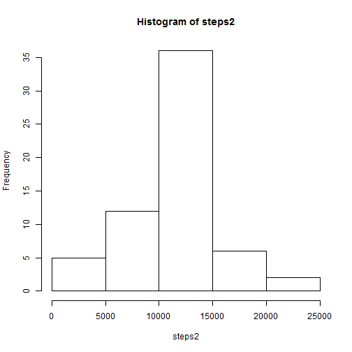
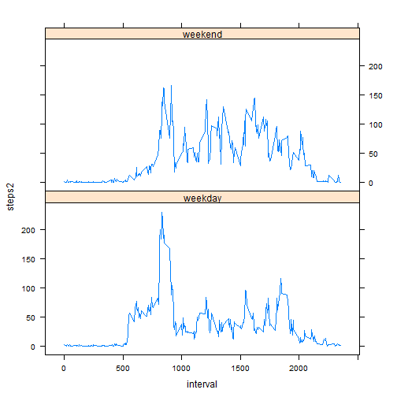

#Peer assignment

##Steps Taken Per Day

first,we have to set our dict and read the data ,then,before we solve the question, take a look about the structure let us know how to solve it 

```r
setwd("C:/Users/user/Desktop/mooc/coursera/r")
data<-read.csv("activity.csv")
str(data)
```

```
## 'data.frame':	17568 obs. of  3 variables:
##  $ steps   : int  NA NA NA NA NA NA NA NA NA NA ...
##  $ date    : Factor w/ 61 levels "2012-10-01","2012-10-02",..: 1 1 1 1 1 1 1 1 1 1 ...
##  $ interval: int  0 5 10 15 20 25 30 35 40 45 ...
```


Then,it's time to solve it,by the tapply function,and we use the hist() to print the histogram

```r
steps<-tapply(data$steps,data$date,sum)
hist(steps)
```

 

Now,it's time to calculate the mean and median,we use the mean,median function easily.

```r
means<-mean(steps,na.rm=TRUE)
medians<-median(steps,na.rm=TRUE)
print(means)
```

```
## [1] 10766.19
```

```r
print(medians)
```

```
## [1] 10765
```

##average daily activity pattern

for,this question,we first want to make the time series,calculate the average steps with the interval,by the tapply function,and plot it.
Then we use simple which.max() to find which is the max


```r
time_series <- tapply(data$steps, data$interval, mean, na.rm = TRUE)
plot(row.names(time_series),time_series,type='l')
```

 

```r
which.max(time_series)
```

```
## 835 
## 104
```

##missing values
for the third question,it is time to handle our NA data,first we use the is.na() and sum() to calculate how many NA

```r
sum(is.na(data$steps))
```

```
## [1] 2304
```
Then ,we use the mean of interval to filling the NA,by the for()

```r
for(i in 1:length(data$steps)){
    if(is.na(data$steps[i]))
        data$steps2[i]<-time_series[paste(sep="",data$interval[i])]
    else
        data$steps2[i]<-data$steps[i]
}
```
Then we make the histgram by hist(),and use mean() and median() to see any difference from original data

```r
steps2<-tapply(data$steps2,data$date,sum)
hist(steps2)
```

 

```r
means2<-mean(steps2,na.rm=TRUE)
medians2<-median(steps2,na.rm=TRUE)
print(means2)
```

```
## [1] 10766.19
```

```r
print(medians2)
```

```
## [1] 10766.19
```
and we can find that it doesn't hase a significant difference wuth original dmean,median

##between weekdays and weekends
Last one, we want to take in the weekend to a variable,use the for() and weekend() to handle it,and then we should use the factor() to ensure the new variable--weekdays is factor.

```r
for(i in 1:length(data$steps)){
    if(weekdays(as.Date(data$date[i]))=="星期日" 
       | weekdays(as.Date(data$date[i]))=="星期六" )
        data$weekdays[i]<-"weekend"
    else
        data$weekdays[i]<-"weekday"
}
data$weekdays<-factor(data$weekdays)
```

Then we use the aggregate() to split the data with interval and weekdays to calculate the mmean.


```r
data$weekdays<-factor(data$weekdays)
time_series2<-aggregate(steps2~weekdays+interval,data=data ,mean)
```

Then we library(lattice),use the xyplot() to plot the time_series2 by interval and panel with weekdays


```r
library(lattice)
xyplot(steps2~interval|weekdays,data=time_series2,type='l',layout=c(1,2))
```

 

