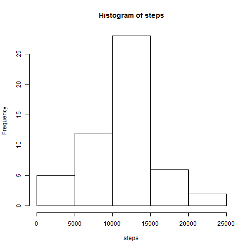
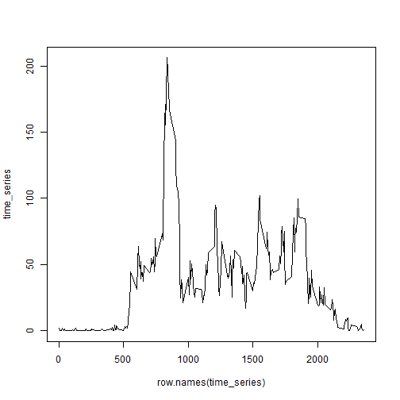

#Reproducible Research Peer Assessments


  In this analysis,first we should set our directory,then read it in to our console.
  Then we use str() to  do some check.

```r
setwd("C:/Users/user/Desktop/mooc/coursera/r")
activity<-read.csv("activity.csv",header=T)
str(activity)
```

```
## 'data.frame':	17568 obs. of  3 variables:
##  $ steps   : int  NA NA NA NA NA NA NA NA NA NA ...
##  $ date    : Factor w/ 61 levels "2012-10-01","2012-10-02",..: 1 1 1 1 1 1 1 1 1 1 ...
##  $ interval: int  0 5 10 15 20 25 30 35 40 45 ...
```
  Second,we can use tapply() to calculate the total number of steps taken per day,than plot some diagram to see it,then use easy mean,median() to see some clue


```r
step<-tapply(activity$step,activity$date,sum) 
hist(step) 
```

 

```r
mean(step,na.rm=T) ##find mean,remove the NA
```

```
## [1] 10766.19
```

```r
median(step,na.rm=T)##find median,remove the NA
```

```
## [1] 10765
```
  Third,we analyze the relation about the average daily activity pattern;we use the tapply() to calculate the mean of the intervals ,then use the plot to show it. 


```r
time_series <- tapply(activity$steps, activity$interval, mean, na.rm = TRUE)
plot(names(time_series), time_series, type = "l", xlab = "interval", 
     ylab = "average across all Days")
```

 

```r
max_place<-which.max(time_series)
names(time_series[max_place])
```

```
## [1] "835"
```
  Fourth,we have to use some number to replace the NA to improve our estimation,at this, we use the interval's mean to replace the NA;we use the aggregate() to deal it with mean first, then we use a variable "steps" to save all steps.
  Then we use the steps to build a new data.frame,and calculate the mean and median.


```r
average <- aggregate(steps ~ interval, data = activity, FUN = mean)
fill <- numeric()
for (i in 1:nrow(activity)) {
    if (is.na(activity[i, ]$steps)) {
        steps <- subset(average, interval == activity[i, ]$interval)$steps
    } else {
        steps <- activity[i, ]$steps
    }
    fill <- c(fill, steps)
}

activity2 <- activity
activity2$steps <- fill

sum<- aggregate(steps ~ date, data =activity2, sum)
```

```
## Error in get(as.character(FUN), mode = "function", envir = envir): 找不到模式 'function' 的物件 'FUN'
```

```r
hist(sum$steps, main = "Total steps by day", xlab = "day")
```

 

```r
mean(sum$steps)
```

```
## [1] 10766.19
```

```r
median(sum$steps)
```

```
## [1] 10766.19
```
  Fifth,we eant to demostrate the difference between weekday and weekend, so first we have to use for() to certificate which is weekend or not; than use the xyplot() to see the differ


```r
library(lattice)
activity$date<-as.Date(activity$date)
day <- weekdays(activity$date)
weekend <- vector()
for (i in 1:nrow(activity)) {
    if (day[i] == "Saturday"| day[i] == "星期六") {
        weekend[i] <- "Weekend"
    } else if (day[i] == "Sunday" | day[i] == "星期日") {
        weekend[i] <- "Weekend"
    } else {
        weekend[i] <- "Weekday"
    }
}
activity$weekend <- weekend
activity$weekend <- factor(activity$weekend)

ans <- aggregate(steps ~ interval + weekend, data = activity, mean)

xyplot(steps ~ interval | weekend, ans, type = "l", layout = c(1, 2), 
    xlab = "Interval", ylab = "Number of steps")
```

 
